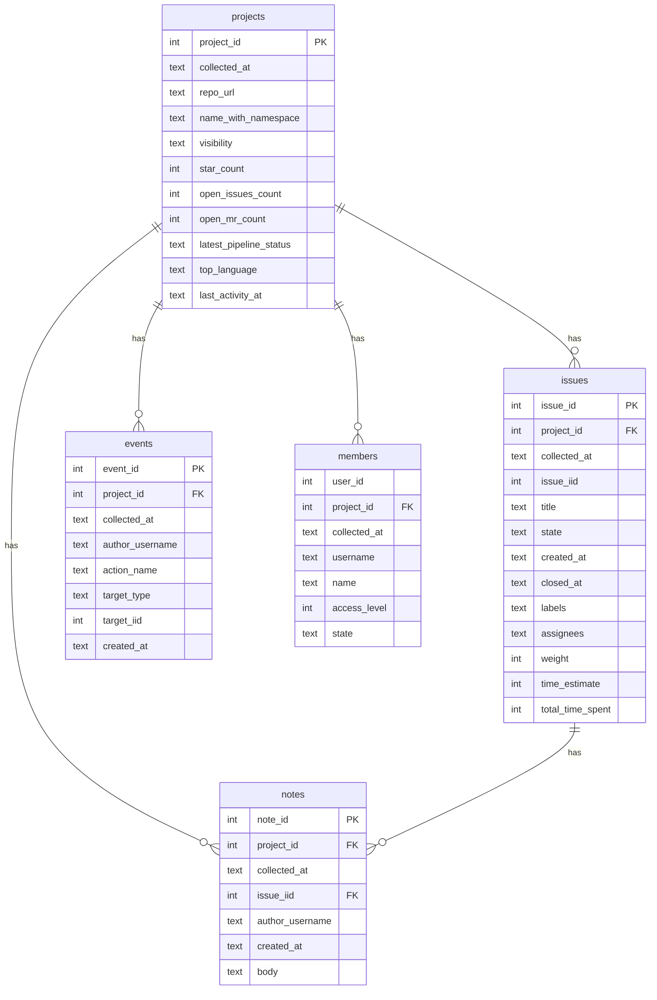
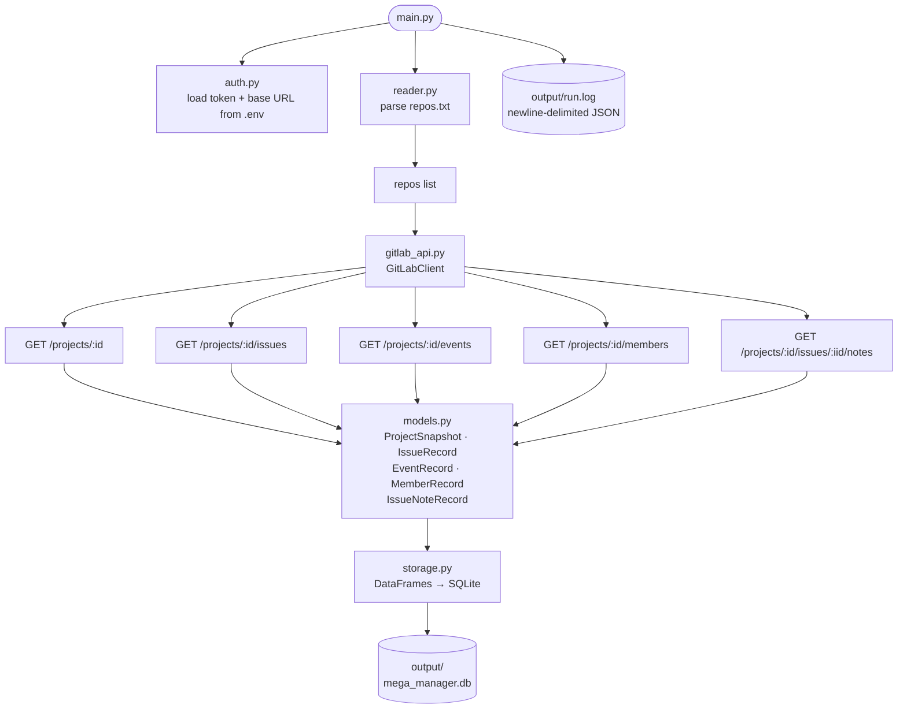

# mega_manager

Fetch project health and issue tracking data from GitLab repos and save it as CSV tables.

## Setup

1. Install dependencies:
   ```
   uv sync
   ```

2. Copy `.env.example` to `.env` and add your GitLab token:
   ```
   GITLAB_TOKEN=your_token_here
   GITLAB_BASE_URL=https://gitlab.com
   ```

3. Add GitLab repo URLs to `repos.txt`, one per line:
   ```
   https://gitlab.com/gitlab-org/gitlab
   https://gitlab.com/gitlab-com/runbooks
   ```

## Running

```
uv run python -m mega_manager.main
```

Edit the `CONFIG` block at the top of `mega_manager/main.py` to control behaviour before running.

## Configuration

| Variable | Default | Description |
|---|---|---|
| `REPOS_FILE` | `repos.txt` | File listing GitLab repo URLs |
| `OUTPUT_DIR` | `output` | Directory for `mega_manager.db` and the run log |
| `ISSUES_STATE` | `all` | Which issues to fetch: `opened`, `closed`, or `all` |
| `ISSUES_SINCE` | `None` | Only fetch issues updated on or after this date (`YYYY-MM-DD`) |
| `ISSUES_LIMIT` | `100` | Max issues per repo; `None` fetches all |
| `FETCH_NOTES` | `False` | Fetch issue comments (1 extra API call per issue) |
| `FETCH_RELATED_MRS` | `False` | Check each issue for linked merge requests |
| `EVENTS_LIMIT` | `500` | Max activity events per repo |
| `LOG_FILE` | `output/run.log` | Path for the structured JSON log file |
| `DEBUG` | `False` | Verbose logging |

## Output

All data is written to `OUTPUT_DIR/mega_manager.db` (SQLite).  Each run appends
new rows to the tables below; every row carries a `collected_at` timestamp so
you can distinguish runs.

| Table | Contents |
|---|---|
| `projects` | One row per repo — stars, visibility, pipeline status, top language, latest commit |
| `issues` | One row per issue — state, labels, assignees, milestone, time tracking |
| `events` | Project activity stream — opens, closes, comments, pushes |
| `members` | Direct project members and their access levels |
| `notes` | Issue comments (only when `FETCH_NOTES = True`) |

---

## Querying the database

### sqlite3 CLI

```bash
sqlite3 output/mega_manager.db

-- list tables
.tables

-- pretty column headers
.headers on
.mode column

-- open issues across all repos
SELECT project_url, count(*) AS open_issues
FROM   issues
WHERE  state = 'opened'
GROUP  BY project_url
ORDER  BY open_issues DESC;

-- most active repos (last 30 days)
SELECT project_url, count(*) AS events
FROM   events
WHERE  created_at >= date('now', '-30 days')
GROUP  BY project_url
ORDER  BY events DESC;
```

### LangChain SQL agent

```python
from langchain_community.utilities import SQLDatabase
from langchain_community.agent_toolkits import create_sql_agent
from langchain_openai import ChatOpenAI

db    = SQLDatabase.from_uri("sqlite:///output/mega_manager.db")
agent = create_sql_agent(ChatOpenAI(model="gpt-4o"), db=db, verbose=True)
agent.invoke("Which repo has the most open issues?")
```

### GUI tools

Any SQLite GUI (e.g. DBeaver) can open `output/mega_manager.db` directly.

---

## Data dictionary

### `projects`

| Column | Type | Description |
|---|---|---|
| `collected_at` | TEXT | ISO-8601 timestamp of the run that produced this row |
| `project_id` | INTEGER | GitLab numeric project ID (join key) |
| `repo_url` | TEXT | URL passed in `repos.txt` |
| `name_with_namespace` | TEXT | Full project name including group, e.g. `mygroup/myrepo` |
| `description` | TEXT | Project description |
| `web_url` | TEXT | GitLab web URL |
| `visibility` | TEXT | `public`, `internal`, or `private` |
| `archived` | INTEGER | `1` if archived, `0` otherwise |
| `default_branch` | TEXT | Name of the default branch |
| `topics` | TEXT | Comma-separated topic tags |
| `star_count` | INTEGER | Number of stars |
| `forks_count` | INTEGER | Number of forks |
| `open_issues_count` | INTEGER | Open issue count reported by GitLab |
| `open_mr_count` | INTEGER | Open merge request count |
| `created_at` | TEXT | Project creation timestamp (ISO-8601) |
| `last_activity_at` | TEXT | Most recent activity timestamp (ISO-8601) |
| `latest_pipeline_status` | TEXT | Status of the most recent CI pipeline |
| `latest_pipeline_created_at` | TEXT | When the most recent pipeline was triggered |
| `top_language` | TEXT | Highest-percentage language |
| `languages_json` | TEXT | Full language breakdown as a JSON object |
| `latest_commit_sha` | TEXT | First 12 characters of the latest commit SHA |
| `latest_commit_message` | TEXT | Title line of the latest commit |
| `latest_commit_date` | TEXT | Latest commit timestamp (ISO-8601) |
| `latest_commit_author` | TEXT | Author name of the latest commit |
| `fetch_errors` | TEXT | Semicolon-separated list of non-fatal fetch errors |

### `issues`

| Column | Type | Description |
|---|---|---|
| `collected_at` | TEXT | ISO-8601 timestamp of the run |
| `project_id` | INTEGER | Foreign key → `projects.project_id` |
| `project_url` | TEXT | Repo URL |
| `issue_iid` | INTEGER | Issue number within the project |
| `issue_id` | INTEGER | GitLab global issue ID |
| `title` | TEXT | Issue title |
| `state` | TEXT | `opened` or `closed` |
| `created_at` | TEXT | Creation timestamp (ISO-8601) |
| `updated_at` | TEXT | Last update timestamp (ISO-8601) |
| `closed_at` | TEXT | Close timestamp, empty if still open |
| `labels` | TEXT | Comma-separated label names |
| `milestone_title` | TEXT | Milestone name |
| `milestone_id` | INTEGER | GitLab milestone ID |
| `assignees` | TEXT | Comma-separated assignee usernames |
| `weight` | INTEGER | Issue weight (if set) |
| `time_estimate` | INTEGER | Time estimate in seconds |
| `total_time_spent` | INTEGER | Total time logged in seconds |
| `has_related_mrs` | INTEGER | `1` if linked MRs exist (requires `FETCH_RELATED_MRS`) |
| `web_url` | TEXT | Direct link to the issue |

### `events`

| Column | Type | Description |
|---|---|---|
| `collected_at` | TEXT | ISO-8601 timestamp of the run |
| `project_id` | INTEGER | Foreign key → `projects.project_id` |
| `project_url` | TEXT | Repo URL |
| `event_id` | INTEGER | GitLab event ID |
| `author_username` | TEXT | Username of the actor |
| `action_name` | TEXT | e.g. `opened`, `closed`, `commented on`, `pushed to` |
| `target_type` | TEXT | e.g. `Issue`, `MergeRequest`, `Note` |
| `target_iid` | INTEGER | IID of the target object within the project |
| `created_at` | TEXT | Event timestamp (ISO-8601) |

### `members`

| Column | Type | Description |
|---|---|---|
| `collected_at` | TEXT | ISO-8601 timestamp of the run |
| `project_id` | INTEGER | Foreign key → `projects.project_id` |
| `project_url` | TEXT | Repo URL |
| `user_id` | INTEGER | GitLab user ID |
| `username` | TEXT | GitLab username |
| `name` | TEXT | Display name |
| `access_level` | INTEGER | `10` Guest · `20` Reporter · `30` Developer · `40` Maintainer · `50` Owner |
| `state` | TEXT | `active`, `blocked`, etc. |

### `notes`

| Column | Type | Description |
|---|---|---|
| `collected_at` | TEXT | ISO-8601 timestamp of the run |
| `project_id` | INTEGER | Foreign key → `projects.project_id` |
| `project_url` | TEXT | Repo URL |
| `issue_iid` | INTEGER | Issue number within the project |
| `note_id` | INTEGER | GitLab note ID |
| `author_username` | TEXT | Comment author |
| `created_at` | TEXT | Comment timestamp (ISO-8601) |
| `body` | TEXT | Comment text (truncated to 500 characters) |

---

## Entity-relationship diagram



## How it works



## Project structure

```
mega_manager/
    auth.py        — load GitLab token and base URL from .env
    gitlab_api.py  — GitLab REST API v4 client
    models.py      — dataclasses for each output table
    reader.py      — parse repos.txt
    storage.py     — write DataFrames to CSV
    main.py        — orchestration and config
repos.txt          — list of GitLab repo URLs to scan
.env               — credentials (not committed)
```
