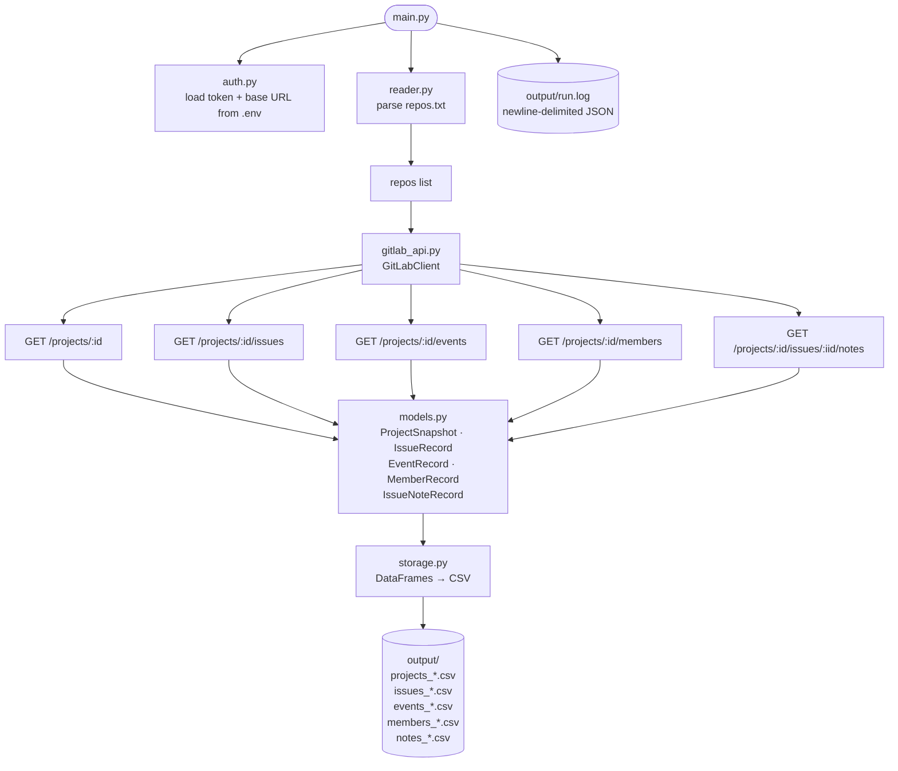

# mega_manager

Fetch project health and issue tracking data from GitLab repos and save it as CSV tables.

## Setup

1. Install dependencies:
   ```
   uv sync
   ```

2. Copy `.env.example` to `.env` and add your GitLab token:
   ```
   GITLAB_TOKEN=your_token_here
   GITLAB_BASE_URL=https://gitlab.com
   ```

3. Add GitLab repo URLs to `repos.txt`, one per line:
   ```
   https://gitlab.com/gitlab-org/gitlab
   https://gitlab.com/gitlab-com/runbooks
   ```

## Running

```
uv run python -m mega_manager.main
```

Edit the `CONFIG` block at the top of `mega_manager/main.py` to control behaviour before running.

## Configuration

| Variable | Default | Description |
|---|---|---|
| `REPOS_FILE` | `repos.txt` | File listing GitLab repo URLs |
| `OUTPUT_DIR` | `output` | Directory for CSV output |
| `ISSUES_STATE` | `all` | Which issues to fetch: `opened`, `closed`, or `all` |
| `ISSUES_SINCE` | `None` | Only fetch issues updated on or after this date (`YYYY-MM-DD`) |
| `ISSUES_LIMIT` | `100` | Max issues per repo; `None` fetches all |
| `FETCH_NOTES` | `False` | Fetch issue comments (1 extra API call per issue) |
| `FETCH_RELATED_MRS` | `False` | Check each issue for linked merge requests |
| `EVENTS_LIMIT` | `500` | Max activity events per repo |
| `LOG_FILE` | `output/run.log` | Path for the structured JSON log file |
| `DEBUG` | `False` | Verbose logging |

## Output

All files are written to `OUTPUT_DIR` with a timestamp suffix.

| File | Contents |
|---|---|
| `projects_*.csv` | One row per repo — stars, visibility, pipeline status, top language, latest commit |
| `issues_*.csv` | One row per issue — state, labels, assignees, milestone, time tracking |
| `events_*.csv` | Project activity stream — opens, closes, comments, pushes |
| `members_*.csv` | Direct project members and their access levels |
| `notes_*.csv` | Issue comments (only when `FETCH_NOTES = True`) |
| `output/run.log` | Newline-delimited JSON log of every run |

## How it works



## Project structure

```
mega_manager/
    auth.py        — load GitLab token and base URL from .env
    gitlab_api.py  — GitLab REST API v4 client
    models.py      — dataclasses for each output table
    reader.py      — parse repos.txt
    storage.py     — write DataFrames to CSV
    main.py        — orchestration and config
repos.txt          — list of GitLab repo URLs to scan
.env               — credentials (not committed)
```
